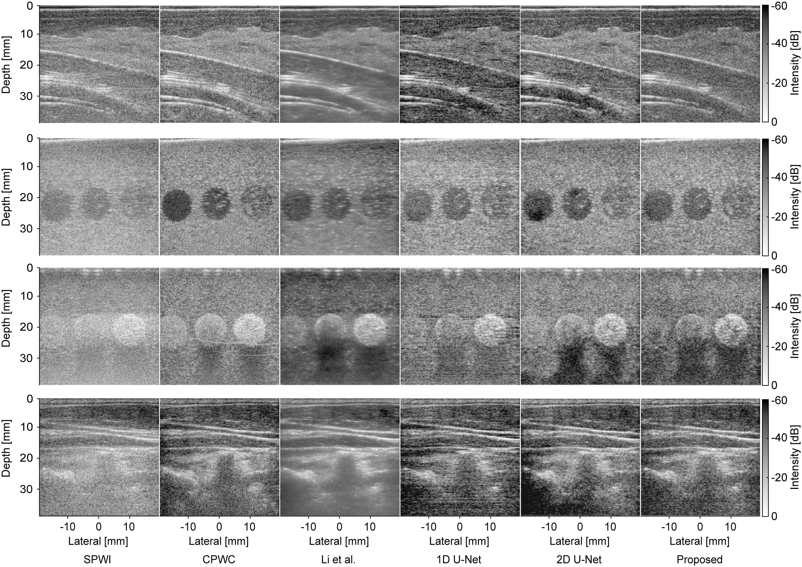

# Image Quality Improvement in Single Plane-Wave Imaging Using Deep Learning

## Introduction
&nbsp;&nbsp;&nbsp;We propose a method to improve the image quality of ultrasound image acquired with a single plane wave in single plane-wave imaging.
The proposed method employs the encoder-decoder model combining 1D U-Net and 2D U-Net to consider that the point spread function of RF signals in the lateral direction varies with depth.
The encoder-decoder model is trained using the frequency loss considering amplitude and phase obtained by 1D discrete Fourier transform of the RF signal in the axial direction.
For more details, please refer to [our paper](https://github.com/gsisaoki/Improvement_of_Ultrasound_Image_Quality).

This repository contains the following used for the results in our paper:
- PyTorch implementation of our method
- our original label of wire and gray-scale targets in ultrasound images
- Trained models of the proposed method

## Requirements  
  * Python 3.9
  * pytorch 1.10

Run the following commands to easily train or test the proposed method,
```
conda create -n env python=3.9
conda activate env
conda install pytorch==1.10.0 torchvision==0.11.0 torchaudio==0.10.0 cudatoolkit=11.3 -c pytorch
pip install -r requirements.txt
```

## Preparation
You can get the source code in either of the following two ways.
- Run the following command.
```
git clone https://github.com/gsisaoki/Improvement_of_Ultrasound_Image_Quality.git
```
- Click [this URL](https://github.com/gsisaoki/Improvement_of_Ultrasound_Image_Quality/archive/refs/heads/master.zip) and unzip the download file.

After you download the source code, run the following command.
```
cd Improvement_of_Ultrasound_Image_Quality-master
mkdir src
mv * src/
cd src
```

## Dataset

In order to download our dataset, please refer to [our project page]().
Our original labels obtained by annotation are included in [coord.json](./coord.json).
You can use "Evaluate" class included in [utils.py](./utils.py) to evaluate the quality of ultrasound images.

## Trained models

The trained model of the proposed method is available from the link below.

[Google Drive](https://drive.google.com/file/d/1SQVKYeT9GFGpYGN_s7HcObTpIcdgpqlT/view?usp=drive_link)(375MB)

## Usage
1. Rewrite root_path (absolute path to src, line 83) and dataset_path (absolute path to downloaded dataset, line 80) in [main.py](./main.py).
2. If you want to train CNN using GPU under same conditions as in our paper , run the following command. In order to change the experimental conditions, rewrite the respective 'train.yaml' file in [yaml](./yaml).  

    `sh exp/train.sh`

3. If you want to test **our trained models**, you need to download the trained model. Set the 'checkpoint_path' in 'test.yaml' file in [yaml](./yaml) to the path of the downloaed model and run the following command.

    `sh exp/eval.sh`

4. If you want to test **your own trained models**, set the 'checkpoint_path' in 'test.yaml' file in [yaml](./yaml) to the path of the saved model in 'USPose/result/' directory and run the above command.

## References
